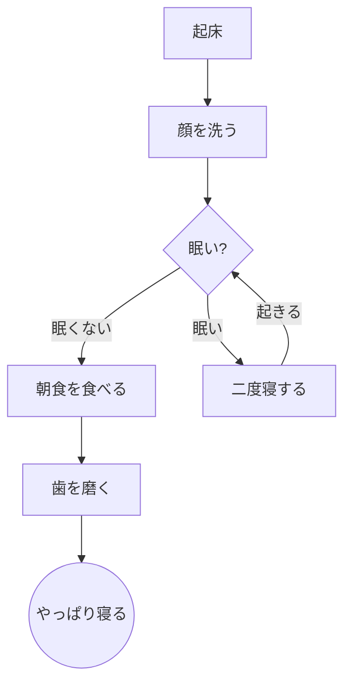

```cpp
#include <iostream>

int main(){
    return 0;
}
```

```bash
cd d:
```


```mermaid
flowchart TB
    A[起床] --> B[顔を洗う] -->
    C{眠い?} -- 眠くない --> D[朝食を食べる]
    C{眠い?} -- 眠い --> E[二度寝する] -- 起きる --> C{眠い?}
    D[朝食を食べる] --> 
    F[歯を磨く] -->
    G((やっぱり寝る))
```
