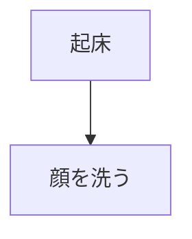

```c++
```



<details><summary>サンプルコード（open属性なし）</summary>

hogehoge world

```ruby
puts 'Hello, World'
```
</details>

:::note info
インフォメーション
infoは省略可能です.
:::

:::note warn
警告
○○に注意してください。
:::

:::note alert
より強い警告
○○しないでください。
:::


